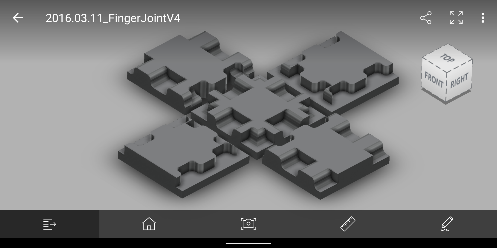
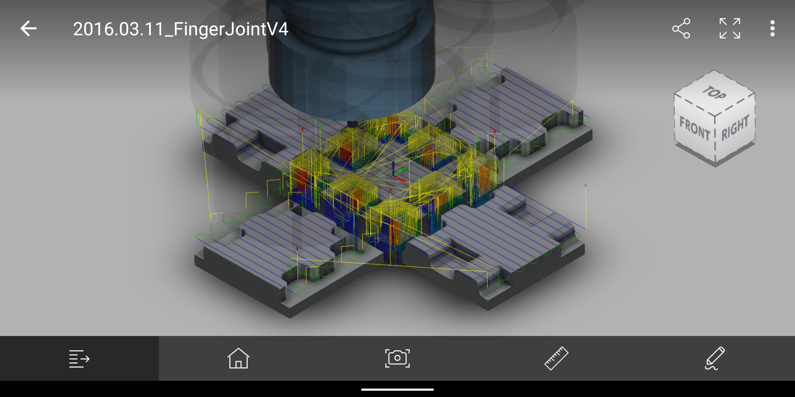

# Fusion360_ParametricBox
A box created in Fusion 360 to be routed out of wood/aluminum using a CNC machine.
Automatically updates and recalculates finger joint locations and quantity based on box and finger joint size.
Parametric design allows for:
- Updating length, width and height of box using parameters
- Updating depth, width and height of finger joints using parameters

## Screenshots
Box example

Toolpath

Note: Fusion 360 files to come
